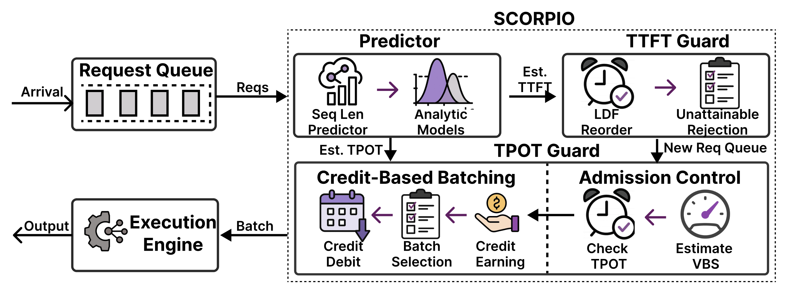

<p align="center">
  
</p>

<h3 align="center">
SLO-Oriented LLM Serving for Heterogeneous Workloads
</h3>

<p align="center">
  <a href="https://arxiv.org/abs/2505.23022">
    
  </a>
  <a href="https://docs.google.com/presentation/d/1gVbQ8IWpcsoGSC_KV0hiPk_EgpSejz7Uak3p8r_nnV0/edit?slide=id.g3780206212d_0_8#slide=id.g3780206212d_0_8">
    
  </a>
</p>

---

## 🔥 What's SCORPIO?

SCORPIO is a system-algorithm co-designed LLM serving engine that **prioritizes heterogeneous Service Level Objectives (SLOs)** like TTFT and TPOT across all scheduling stages. It improves both **goodput** and **SLO adherence** through adaptive queueing, batching, and rejection mechanisms.

<p align="center">
  
</p>

## ✨ Key Features

- 🕒 **TTFT Guard**: Least-Deadline-First (LDF) scheduling and rejection of unattainable requests.
- ⚖️ **TPOT Guard**: VBS-based admission + credit-based batching for fine-grained control.
- 🔮 **Lightweight Predictor**: Sequence length prediction with calibrated bucketing.
- 🚀 **Built on vLLM**: Extends vLLM with SLO-oriented scheduling logic.
- 📊 **Up to 14.4× Goodput** and **46.5% SLO Improvement** vs state-of-the-art.

## 🛠️ Installation

Create the environment and install the SCORPIO engine:

```bash
conda create -n scorpio python=3.12
conda activate scorpio

export VLLM_COMMIT=635b897246da121238454ed4b2bbc87cb4d4166b
export VLLM_PRECOMPILED_WHEEL_LOCATION=https://wheels.vllm.ai/${VLLM_COMMIT}/vllm-1.0.0.dev-cp38-abi3-manylinux1_x86_64.whl

pip install --editable .
```

## 📥 Download Datasets and Models

### Datasets

```bash
mkdir datasets && cd datasets
huggingface-cli download --repo-type dataset --resume-download Brookseeworld/Scropio-dataset --local-dir .
```

### Models

```bash
mkdir MODELS && cd MODELS
huggingface-cli download --resume-download Brookseeworld/Scropio-seq-len-predictor --local-dir .
```

## ⚙️ Quickstart

> **Note:** Ensure all paths and configurations are correct before launching.

### 1. Launch Sequence Length Predictor

```bash
conda activate scorpio
python benchmarks/script/entry_predict.py --dataset sharegpt --model 8b
```

### 2. Start the Inference Engine (SCORPIO)

```bash
conda activate scorpio
python benchmarks/script/entry_serving.py --config benchmarks/config/llama8b-sharegpt/minitest.json
```


## 🧠 Citation

If you use SCORPIO, please cite us:

```bibtex
@article{tang2025scorpio,
  title={SCORPIO: Serving the Right Requests at the Right Time for Heterogeneous SLOs in LLM Inference},
  author={Tang, Yinghao and Lan, Tingfeng and Huang, Xiuqi and Lu, Hui and Chen, Wei},
  journal={arXiv preprint arXiv:2505.23022},
  year={2025}
}
```

