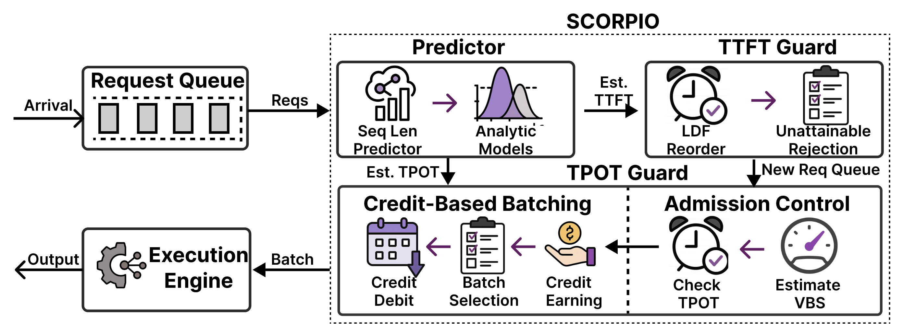

<p align="center">
  
</p>

<h3 align="center">
SLO-Oriented LLM Serving for Heterogeneous Workloads
</h3>

---

## 🔥 What's SCORPIO?

SCORPIO is a system-algorithm co-designed LLM serving engine that **prioritizes heterogeneous Service Level Objectives (SLOs)** like TTFT and TPOT across all scheduling stages. It improves both **goodput** and **SLO adherence** through adaptive queueing, batching, and rejection mechanisms.

<p align="center">
  
</p>

## ✨ Key Features

- 🕒 **TTFT Guard**: Least-Deadline-First (LDF) scheduling and rejection of unattainable requests.
- ⚖️ **TPOT Guard**: VBS-based admission + credit-based batching for fine-grained control.
- 🔮 **Lightweight Predictor**: Sequence length prediction with calibrated bucketing.
- 🚀 **Built on vLLM**: Extends vLLM with SLO-oriented scheduling logic.
- 📊 **Up to 14.4× Goodput** and **46.5% SLO Improvement** vs state-of-the-art.

## 🛠️ Installation

Create the environment and install the SCORPIO engine:

```bash
conda create -n scorpio python=3.12
conda activate scorpio

export VLLM_COMMIT=635b897246da121238454ed4b2bbc87cb4d4166b
export VLLM_PRECOMPILED_WHEEL_LOCATION=https://wheels.vllm.ai/${VLLM_COMMIT}/vllm-1.0.0.dev-cp38-abi3-manylinux1_x86_64.whl

pip install --editable .
```

## 📥 Download Datasets and Models

### Datasets

```bash
mkdir datasets && cd datasets
# Dataset will be made available upon paper acceptance
# For now, please contact the anonymous submission for access
echo "Dataset access instructions will be provided upon paper acceptance"
```

### Models

```bash
mkdir MODELS && cd MODELS
# Pre-trained models will be made available upon paper acceptance
# For now, please contact the anonymous submission for access  
echo "Model access instructions will be provided upon paper acceptance"
```

## ⚙️ Quickstart

> **Note:** Ensure all paths and configurations are correct before launching.

### 1. Launch Sequence Length Predictor

```bash
conda activate scorpio
python benchmarks/script/entry_predict.py --dataset sharegpt --model 8b
```

### 2. Start the Inference Engine (SCORPIO)

```bash
conda activate scorpio
python benchmarks/script/entry_serving.py --config benchmarks/config/llama8b-sharegpt/minitest.json
```

## 🧠 Citation

If you use SCORPIO, please cite our paper:

```bibtex
@inproceedings{anonymous2026scorpio,
  title={SCORPIO: Serving the Right Requests at the Right Time for Heterogeneous SLOs in LLM Inference},
  author={Anonymous Authors},
  booktitle={Under Review for ICLR 2026},
  year={2026}
}
```

**Note:** Full citation details will be provided upon paper acceptance.

---

## 📄 Paper Under Review

This work is currently under review for **ICLR 2026**. All identifying information has been removed to maintain anonymity during the review process.
